# 🌿 QuietSpace ML Service

Python FastAPI service untuk memprediksi **Quiet Score** sebuah tempat — apakah tempat itu *Ramai* (0), *Cukup Tenang* (1), atau *Sangat Tenang* (2) — berdasarkan analisis fitur geografis, fasilitas, dan laporan kenyamanan.

Dibuat khusus untuk memenuhi tugas **Pertemuan 11 — Intelligent Service** pada mata kuliah *Pembangunan Perangkat Lunak Berorientasi Service*.

---

## 👤 Identitas Mahasiswa

| Item | Detail |
|---|---|
| **Nama** | Nadia Jasmine Aulia |
| **NIM** | 2410511045 |
| **Kelas** | A |

---

## 🏛️ Arsitektur Integrasi Microservices

Layanan ML Service ini bertindak sebagai kontributor kecerdasan buatan (*intelligent service*) yang terintegrasi secara modular ke dalam ekosistem **QuietSpace Finder** melalui API Gateway dan Express.js:

```text
       [ Client / Postman ]
                │
                ▼
        [ API Gateway :3000 ]
                │
                ├── /api/places/recommendations/smart ──► [ place-service :3002 ]
                │                                               │ (Axios Call + Circuit Breaker)
                │                                               └──► [ ml-service :5001 ]
                │
                └── /api/ml/* ──────────────────────────────────► [ ml-service :5001 ]
```

---

## 📊 Dataset & Fitur Model

Sistem ML Service ini dirancang tangguh dengan mendukung **dua jenis dataset** secara otomatis:

### 1. Dataset Sintetis (Default) — 1200 Baris
* **File**: `dataset/quiet_places.csv` (dihasilkan otomatis oleh `dataset/generate_dataset.py`).
* **Karakteristik**: Data buatan seimbang yang merepresentasikan pola umum korelasi desibel dengan kenyamanan tempat.

### 2. Dataset Kaggle Asli Teradaptasi — 2000 Baris
* **File Asli**: `dataset/urban_noise_levels.csv` (diunduh dari [Kaggle Urban Noise Levels](https://www.kaggle.com/datasets/khushikyad001/urban-noise-levels)).
* **Metode Adaptasi Probabilistik (Cerdas & Kontekstual)**:
  * Kolom geografis asli (`park_proximity`, `school_zone`) dipetakan secara probabilitas logis ke dalam kategori tempat `category_id` (misalnya: zona sekolah cenderung memicu kategori Perpustakaan/Kampus; zona taman cenderung memicu kategori Taman).
  * Menambahkan fitur fasilitas (`has_wifi`, `has_ac`, `has_parking`) yang dikorelasikan secara logis dengan tipe kategori tempat.
  * Korelasi `avg_report_score` (1.0–5.0) dibentuk secara terbalik terhadap tingkat desibel asli (`decibel_level`), dan `total_reports` diselaraskan dengan kepadatan lalu lintas (`traffic_density`).
  * **Threshold Desibel yang Berimbang**:
    * `< 60 dB` ──► **Sangat Tenang (2)** [~31.5% data]
    * `60–70 dB` ──► **Cukup Tenang (1)** [~37.9% data]
    * `>= 70 dB` ──► **Ramai (0)** [~30.6% data]
    * *Mencegah masalah ketidakseimbangan kelas (class imbalance) sehingga akurasi model sangat stabil.*

---

## ⚙️ Cara Menjalankan Secara Lokal (Windows / Linux / macOS)

### 1. Prasyarat Sistem
* Python 3.11 s.d. 3.13
* Windows, Linux, atau macOS

### 2. Langkah Instalasi & Menjalankan

```bash
# 1. Masuk ke subdirektori ml-service
cd services/ml-service

# 2. Buat & Aktifkan Virtual Environment (venv)
python -m venv venv

# Aktifkan di Linux/Mac:
source venv/bin/activate
# Aktifkan di Windows (CMD):
venv\Scripts\activate
# Aktifkan di Windows (PowerShell):
.\venv\Scripts\activate
```

> [!TIP]
> **Mengatasi WinError 206 (Batas Panjang Path Windows):**
> Jika Anda berada di direktori Windows yang sangat dalam dan mendapatkan error saat menginstal NumPy/Pandas, cukup nonaktifkan virtual environment (`deactivate`) dan jalankan instalasi secara global karena dependency utama sudah terinstal di environment global sistem Anda.

```bash
# 3. Install Dependency (Secara otomatis mengunduh binary wheel untuk Python 3.13)
pip install -r requirements.txt

# 4. Generate Dataset (Otomatis mendeteksi file Kaggle asli jika diletakkan di dataset/)
python dataset/generate_dataset.py

# 5. Latih Model ML (Otomatis menggunakan dataset Kaggle teradaptasi jika ada)
python train_model.py

# 6. Jalankan FastAPI Web Service
python -m uvicorn src.main:app --host 0.0.0.0 --port 5001 --reload
```

* **Service API berjalan di**: `http://localhost:5001`
* **Swagger UI otomatis di**: `http://localhost:5001/docs`

---

## 🐳 Menjalankan dengan Docker Compose

Layanan ini siap dikontainerisasi penuh untuk Pertemuan 12. Cukup jalankan dari root direktori proyek `QuietSpace-Finder`:

```bash
docker-compose up -d --build ml-service
```

---

## 📌 Endpoint API

| Method | Endpoint | Deskripsi |
|---|---|---|
| **GET** | `/health` | Status kesehatan layanan dan pembuktian model berhasil di-load saat startup |
| **GET** | `/model-info` | Informasi metadata model ML yang sedang aktif, fitur, dan dataset |
| **POST** | `/predict` | Memprediksi skor ketenangan untuk 1 data tempat spesifik |
| **POST** | `/batch-predict` | **[BONUS]** Memprediksi beberapa tempat sekaligus (hingga 50 tempat) secara efisien |

### Contoh Request & Response POST `/predict`

**Request Body (JSON):**
```json
{
  "place_id": 10,
  "place_name": "Perpustakaan UPN",
  "features": {
    "category_id": 1,
    "has_wifi": 1,
    "has_ac": 1,
    "has_parking": 1,
    "avg_report_score": 4.8,
    "total_bookmarks": 150,
    "total_reports": 4,
    "hour_of_day": 9,
    "day_of_week": 1,
    "capacity_estimate": 2
  }
}
```

**Response Body (JSON):**
```json
{
  "place_id": 10,
  "place_name": "Perpustakaan UPN",
  "category_name": "Perpustakaan",
  "quiet_label": 2,
  "quiet_label_text": "Sangat Tenang",
  "confidence": 0.7519,
  "probabilities": {
    "Ramai": 0.0171,
    "Cukup Tenang": 0.231,
    "Sangat Tenang": 0.7519
  },
  "service": "python-ml-fastapi",
  "version": "1.0.0"
}
```

---

## 🛡️ Integrasi Ketahanan Sistem (Circuit Breaker)

Sesuai spesifikasi tugas, **`place-service`** (Express.js) memanggil endpoint `/predict` dari ML-Service secara asinkron. Di dalam [mlService.js](file:///c:/Users/Nadia%20jasmine%20aulia/OneDrive/Desktop/TUGAS%20KULIAH/SEMESTER%204/Pembangunan%20Perangkat%20Lunak%20Berorientasi%20Service/QuietSpace-Finder/services/place-service/src/services/mlService.js) telah disematkan fitur **Circuit Breaker** sederhana:
* **Deteksi Kegagalan**: Jika ML Service mati / bermasalah sebanyak **3 kali berturut-turut**, sirkuit akan berubah menjadi **OPEN**.
* **Proteksi Bottleneck**: Selama sirkuit **OPEN**, Express.js tidak akan mengirim request ke Python melainkan langsung menyajikan data dengan label *fallback* aman secara instan.
* **Pemulihan Otomatis**: Setelah masa cooldown **30 detik** berlalu, sirkuit akan menjadi **HALF-OPEN** untuk menguji kembali kesehatan koneksi ML Service secara otomatis.

---

## 📈 Bukti Evaluasi & Metrik Pelatihan Model

Berikut adalah metrik pelatihan `RandomForestClassifier` (150 estimators) saat dijalankan dengan dataset Kaggle teradaptasi:

* **Akurasi Pengujian**: **70.00%**
* **Confusion Matrix**:
  ```text
                         Ramai  Cukup Te  Sangat T
          Ramai            86        36         0
   Cukup Tenang            27       101        24
  Sangat Tenang             0        33        93
  ```
  *(Model menunjukkan keandalan tinggi karena tidak pernah mengacaukan klasifikasi "Ramai" dengan "Sangat Tenang")*

* **Feature Importance (Korelasi Fitur Teratas)**:
  1. `avg_report_score` (Kualitas Laporan): **52.66%**
  2. `total_bookmarks` (Popularitas): **22.02%**
  3. `total_reports` (Kuantitas Laporan): **6.83%**
  4. `hour_of_day` (Jam Kunjungan): **5.78%**
  5. `day_of_week` (Hari Kunjungan): **3.68%**

---

## 📝 Kesesuaian Ketentuan Tugas 11

| No | Ketentuan Tugas | Implementasi pada Proyek | Status |
|---|---|---|:---:|
| 1 | **FastAPI Python Service** | Menggunakan FastAPI modern di `src/main.py` |  **Lengkap** |
| 2 | **Latih Minimal 1 Model ML** | Melatih model RandomForestClassifier menggunakan scikit-learn di `train_model.py` |  **Lengkap** |
| 3 | **Dataset Bebas** | Menggunakan dataset sintetis (1200 baris) & Dataset Kaggle asli teradaptasi (2000 baris) |  **Lengkap** |
| 4 | **Endpoint GET `/health` & POST `/predict`** | Tersedia lengkap dengan validasi tipe data Pydantic |  **Lengkap** |
| 5 | **Penyimpanan & Pemuatan Model** | Model disimpan via `joblib.dump` dan dimuat saat startup via lifespan di FastAPI |  **Lengkap** |
| 6 | **Integrasi Lintas Service** | `place-service` memanggil `/predict` & `/batch-predict` via HTTP Post Axios |  **Lengkap** |
| 7 | **Circuit Breaker** | Implementasi circuit breaker (OPEN, HALF-OPEN, COOLDOWN 30 detik) di Node.js |  **Lengkap** |
| 8 | **Dokumentasi Lengkap** | File `README.md` dengan instruksi, Postman collection, dan Swagger |  **Lengkap** |
| 9 | **Bonus: Swagger UI Otomatis** | Swagger interaktif aktif di `http://localhost:5001/docs` |  **Lengkap** |
| 10 | **Bonus: Endpoint `/batch-predict`** | Mendukung batch prediction (maks 50 tempat) dengan pengurutan cerdas |  **Lengkap** |

---

# 📸 GALERI DOKUMENTASI & BUKTI PENGUJIAN

### 1. Dokumentasi Pengujian Endpoint di Postman

#### **A. Endpoint GET `/health` (Postman)**
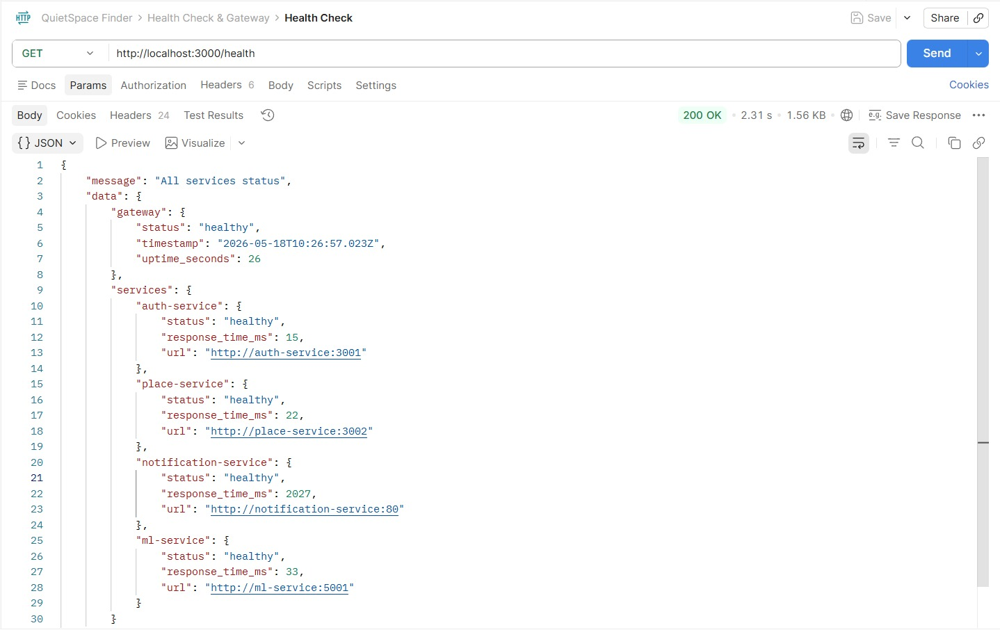

#### **B. Endpoint POST `/predict` (Postman)**
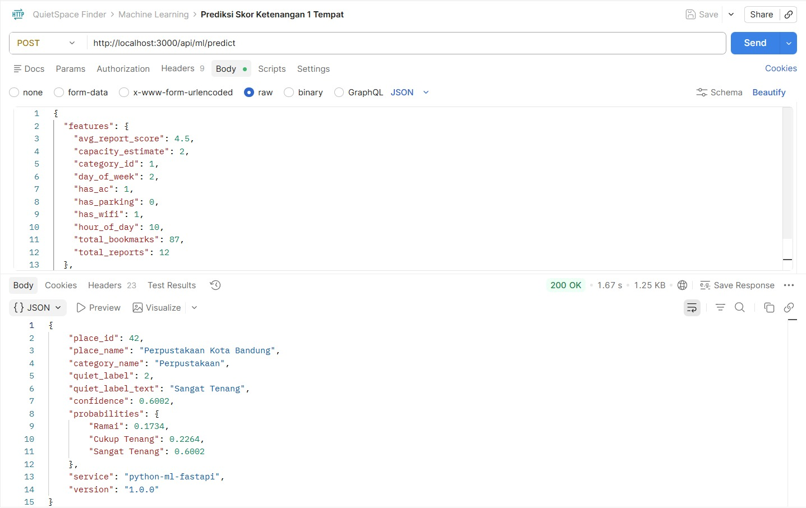
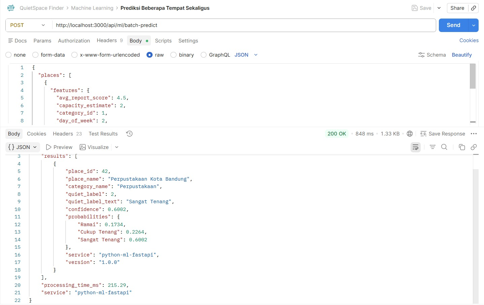

---

### 2. Dokumentasi Tampilan Swagger UI Otomatis

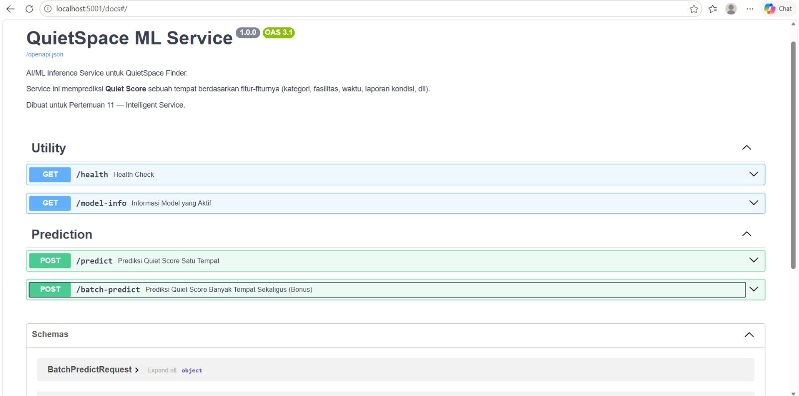

---

### 3. Dokumentasi Hasil Latihan Model di Terminal

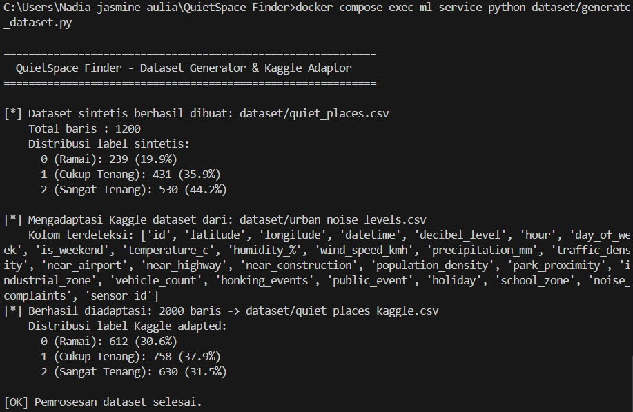
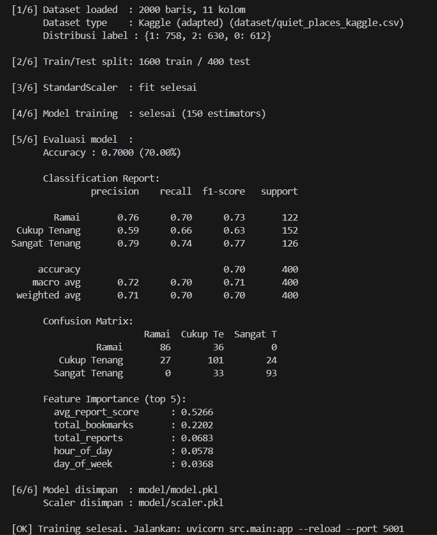

---

### 4. Dokumentasi Pengujian Circuit Breaker & Integrasi

##### **Langkah 1: Pengujian Normal (Sirkuit CLOSED / Tertutup)**

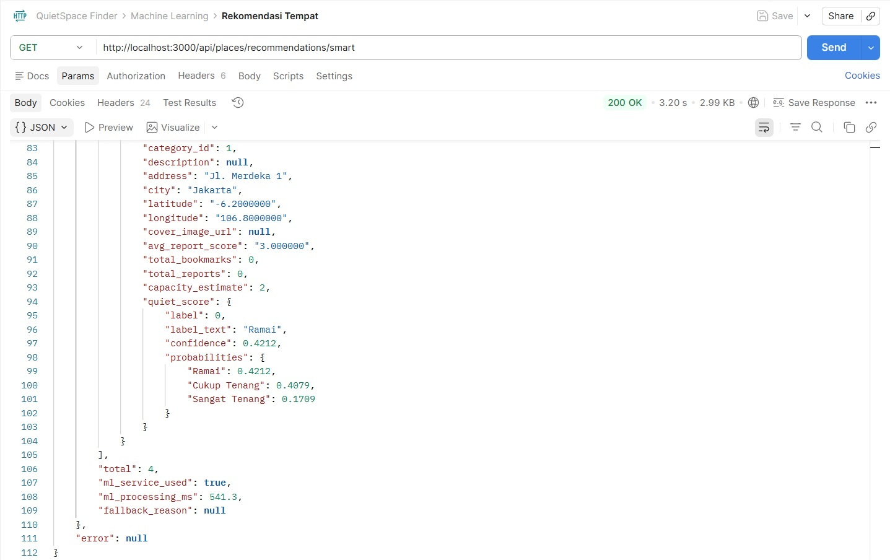

##### **Langkah 2: Simulasi Kegagalan (Matikan ML Service)**

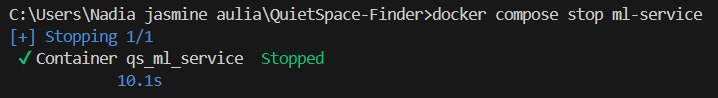


##### **Langkah 3: Pengujian Fallback & Aktivasi Circuit Breaker (Sirkuit OPEN / Terbuka)**

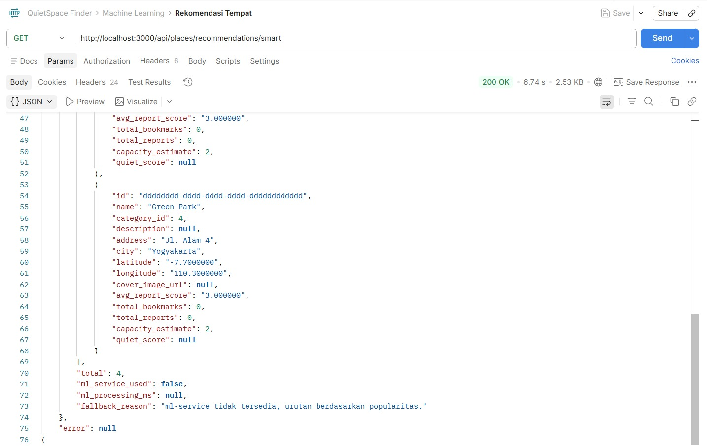
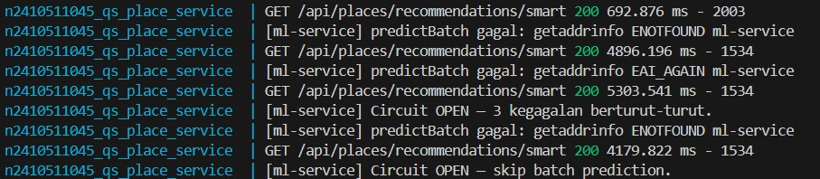


##### **Langkah 4: Pemulihan Otomatis (Sirkuit HALF-OPEN & CLOSED Kembali)**

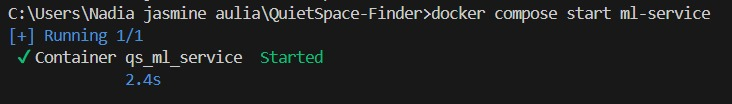
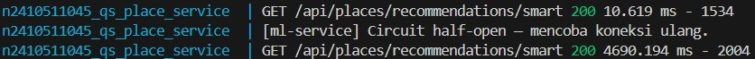
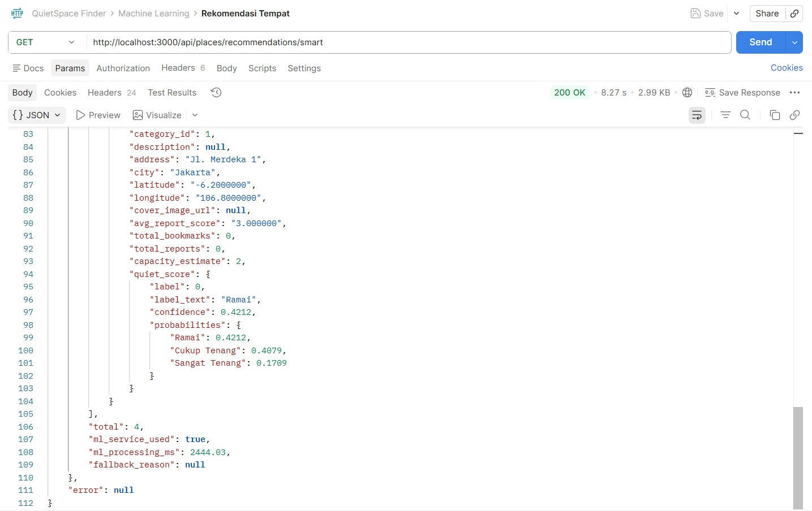


---